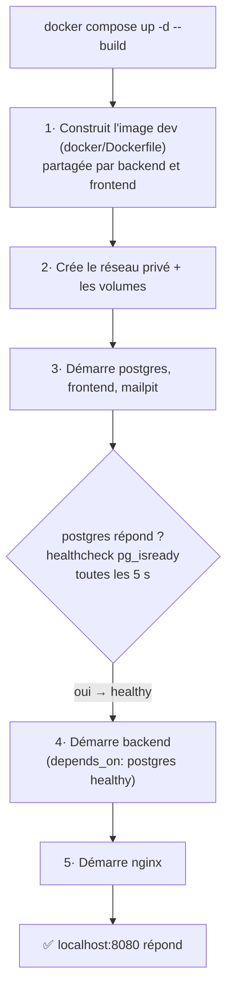
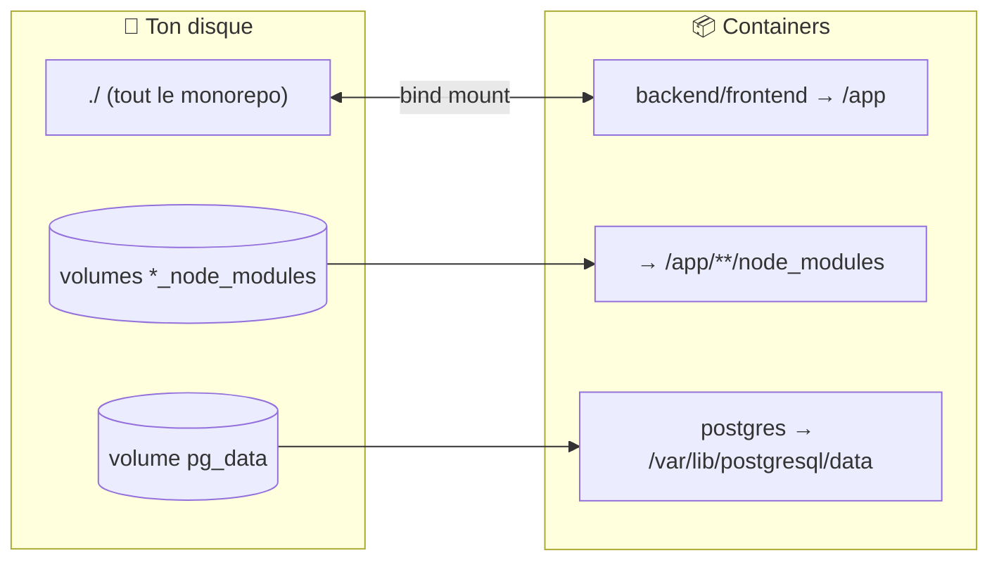
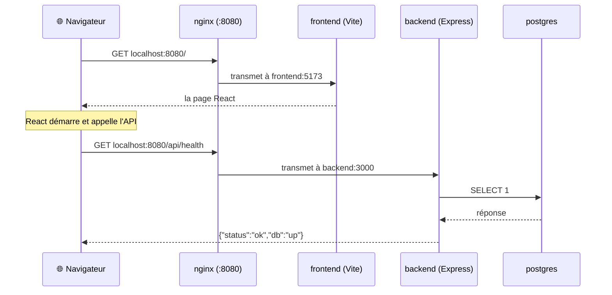

# Comprendre notre setup Docker (en partant de zéro)

> Pour voir les schémas : pousse sur GitHub (rendu automatique) ou installe
> l'extension VSCode « Markdown Preview Mermaid Support » puis `Ctrl+Shift+V`.

## 1. Docker, c'est quoi (30 secondes)

- Un **container** = une mini-machine isolée qui fait tourner UN programme avec tout ce
  dont il a besoin (la bonne version de Node, les bonnes libs…).
- Une **image** = la recette figée d'un container (le moule). Un container = une instance
  vivante de cette image (le gâteau).
- **Pourquoi** : plutôt que d'installer Node et PostgreSQL sur ta machine, tout tourne dans
  des containers avec Node 22. Bonus : ton mate a EXACTEMENT le même environnement que toi.

## 2. Nos 5 containers et qui parle à qui

| Container | Image | Rôle |
|---|---|---|
| `nginx` | nginx:1.28-alpine | le **portier** : seule porte d'entrée (:8080), il aiguille chaque requête |
| `frontend` | node:22 + Vite | sert la SPA React en mode dev (hot reload) |
| `backend` | node:22 + Express | l'API : logique métier + accès à la DB |
| `postgres` | postgres:17-alpine | la base de données |
| `mailpit` | axllent/mailpit | fausse boîte mail de dev (UI sur :8025) |

**`frontend` et `backend` partagent la MÊME image** (`docker/Dockerfile`). C'est un monorepo
pnpm : un seul `pnpm install` installe les deux packages. Seuls le **`working_dir`** et la
**commande** changent (cf. `docker-compose.yml`) :

| Service | working_dir | commande |
|---|---|---|
| backend | `/app/src/backend` | `pnpm dev` → `tsx watch src/main.ts` |
| frontend | `/app/src/frontend` | `pnpm dev` → `vite --host` |


**Point clé** : ton navigateur ne parle QU'À nginx (et à l'UI Mailpit). Il ne voit jamais
directement le frontend, le backend ou la DB. Un seul point d'entrée = cookies de session
simples et zéro problème de CORS.

**Deuxième point clé** : à l'intérieur, les containers se parlent **par leur nom de service**.
Docker crée un réseau privé avec un DNS intégré : `backend` joint la DB à `postgres:5432`
(`POSTGRES_HOST=postgres` dans le `.env`), nginx joint l'API à `backend:3000`
(`nginx/nginx.conf`). **Le nom du service DANS `docker-compose.yml` EST son adresse réseau.**

## 3. docker-compose.yml : le chef d'orchestre

Il décrit tout (quelle image, quels ports, quels volumes, quel ordre) et `docker compose up`
exécute l'ensemble.



Le `healthcheck` + `depends_on` évite un piège classique : sans ça, le backend démarre avant
que la DB soit prête et crashe au boot.

## 4. Le Dockerfile : la recette de l'image

```dockerfile
FROM node:22-alpine AS dev
RUN corepack enable                    # active pnpm (fourni avec Node 22)
WORKDIR /app
COPY package.json pnpm-workspace.yaml pnpm-lock.yaml* ./   # manifestes du workspace
COPY src/backend/package.json  ./src/backend/package.json
COPY src/frontend/package.json ./src/frontend/package.json
RUN pnpm install                       # installe les DEUX packages en une passe
CMD ["pnpm", "dev"]                    # surchargé par chaque service
```

**Pourquoi copier les manifestes seuls avant `pnpm install` ?** Le **cache**. Docker mémorise
chaque étape : tant que les `package.json` et le lockfile ne changent pas, le `pnpm install`
(l'étape lente) n'est jamais refait.

On ne copie **pas** le code source : il arrive par bind mount (section suivante). Et on ne
copie rien pour `src/common`, puisque ce n'est pas un package npm — juste des sources,
présentes via le bind mount.

## 5. Bind mounts & volumes : OÙ est mon code, OÙ sont mes données



- **Bind mount** (`.:/app`) : la racine du repo et `/app` dans le container sont **le même
  dossier**. Tu édites dans VSCode → le container le voit → hot reload. Ton code n'est jamais
  « copié dans Docker », il vit chez toi. C'est aussi ce qui rend **`src/common` visible des
  deux containers** sans configuration supplémentaire.

- **Les 3 volumes `*_node_modules`** — le piège rusé. Le bind mount recouvre TOUT `/app`, y
  compris les `node_modules` installés dans l'image. Or sur ton disque ils peuvent être
  absents (ou compilés pour macOS, pas pour Linux !). Sans astuce, le container verrait des
  dossiers vides → crash. On monte donc des volumes nommés par-dessus, qui « percent un trou »
  dans le bind mount :

  | Volume | Monté sur |
  |---|---|
  | `root_node_modules` | `/app/node_modules` |
  | `backend_node_modules` | `/app/src/backend/node_modules` |
  | `frontend_node_modules` | `/app/src/frontend/node_modules` |

  Il en faut **trois** parce que pnpm crée un `node_modules` **par package** (chacun ne voit
  que SES dépendances — c'est l'isolation stricte de pnpm).

- **Volume `pg_data`** : les données de la DB survivent aux redémarrages. Elles ne meurent
  que sur `docker compose down -v`.

- **Volume `uploads`** : partagé entre backend (qui écrira les photos) et nginx (qui les
  servira en lecture seule). Vide pour l'instant.

## 6. Le trajet complet d'une requête



nginx décide où transmettre selon le début de l'URL (`nginx/nginx.conf`) :

| L'URL commence par | Va vers | Pour |
|---|---|---|
| `/api/` | backend:3000 | l'API |
| `/socket.io/` | backend:3000 | le chat / notifs temps réel (plus tard) |
| `/uploads/` | (fichiers du volume) | les photos de profil (plus tard) |
| `/` (tout le reste) | frontend:5173 | la SPA React |

### Le cas particulier du HMR (hot reload)

Vite pousse ses mises à jour par **WebSocket**. Comme le navigateur ne parle qu'à nginx, il
faut deux réglages, sinon le hot reload boucle :

1. `nginx.conf` : les en-têtes `Upgrade`/`Connection` sur `location /` (bascule WebSocket).
2. `vite.config.ts` : `hmr: { clientPort: 8080 }` → on dit au client HMR de se reconnecter
   sur **8080** (nginx), et pas sur 5173 qu'il ne voit pas.

## 7. FAQ

**Où s'exécute mon code ?** Dans le container (Node 22), mais les fichiers restent sur ton
disque grâce au bind mount. Tu édites normalement.

**Pourquoi le port 8080 et pas 80 ?** Docker rootless (sans droits admin) ne peut pas prendre
les ports < 1024.

**`down` vs `down -v` ?** `down` supprime les containers mais les volumes (données DB)
survivent. `down -v` supprime **aussi** les volumes → DB vide au prochain démarrage.

**Quand faut-il rebuild ?** Seulement si tu touches le `Dockerfile`, un `package.json` ou le
lockfile → `docker compose up -d --build`. Pour le code de `src/`, **jamais** : le hot reload
s'en charge.

**`pnpm install` échoue sur des « build scripts » ?** pnpm refuse d'exécuter les `postinstall`
non approuvés (sécurité). Lance `pnpm approve-builds --all` : ça écrit la clé `allowBuilds`
dans `pnpm-workspace.yaml`, qui est copiée dans l'image.

**Voir ce qui se passe :**
```bash
docker compose ps                 # qui tourne (cherche "Up" partout)
docker compose logs -f backend    # logs en direct d'un service
docker compose exec backend sh    # terminal DANS le container
```

## 8. Mini-glossaire

| Mot | Définition en une ligne |
|---|---|
| Image | recette figée (OS minimal + Node + deps) — se construit, ne s'exécute pas |
| Container | instance vivante d'une image — démarre, tourne, s'arrête |
| Dockerfile | le fichier texte qui décrit comment construire une image |
| Compose | l'outil qui lance/relie plusieurs containers d'après `docker-compose.yml` |
| Bind mount | dossier de ton disque partagé tel quel avec un container |
| Volume | stockage géré par Docker, persistant, invisible dans ton projet |
| Healthcheck | commande répétée qui dit si un service est réellement prêt |
| Stage | une des recettes d'un Dockerfile (`dev` ici ; `build`/`prod` plus tard) |
