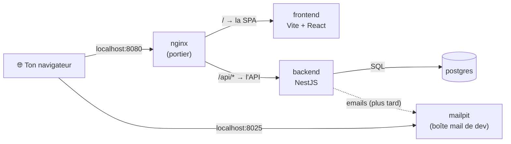
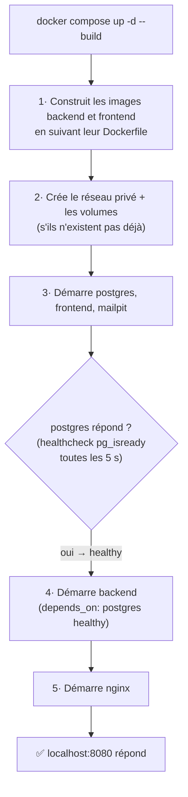
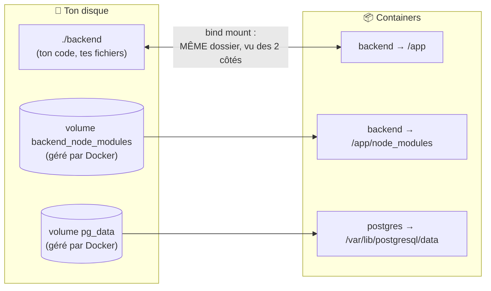
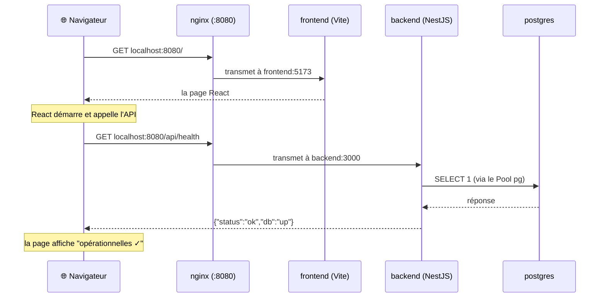

# Comprendre notre setup Docker (en partant de zéro)

> Pour voir les schémas : pousse sur GitHub (rendu automatique) ou installe
> l'extension VSCode « Markdown Preview Mermaid Support » puis `Ctrl+Shift+V`.

## 1. Docker, c'est quoi (30 secondes)

- Un **container** = une mini-machine isolée qui fait tourner UN programme avec
  tout ce dont il a besoin (la bonne version de Node, les bonnes libs…).
- Une **image** = la recette figée d'un container (le moule). Un container = une
  instance vivante de cette image (le gâteau).
- **Pourquoi nous en avons besoin** : ta machine a Node v12 (2019), trop vieux
  pour React/NestJS modernes. Plutôt que d'installer quoi que ce soit, on fait
  tout tourner dans des containers avec Node 22. Bonus : ton mate aura
  EXACTEMENT le même environnement que toi, à l'octet près.

## 2. Nos 5 containers et qui parle à qui

| Container | Image | Rôle |
|---|---|---|
| `nginx` | nginx:1.28-alpine | le **portier** : seule porte d'entrée (port 8080), il aiguille chaque requête |
| `frontend` | node:22 + Vite | sert la SPA React en mode dev (hot reload) |
| `backend` | node:22 + NestJS | l'API : logique métier + accès à la DB |
| `postgres` | postgres:17-alpine | la base de données |
| `mailpit` | axllent/mailpit | fausse boîte mail de dev (UI sur :8025) |



**Point clé** : ton navigateur ne parle QU'À nginx (et à l'UI Mailpit). Il ne
voit jamais directement le frontend, le backend ou la DB. C'est voulu : un seul
point d'entrée = cookies de session simples et pas de problèmes cross-origin.

**Deuxième point clé** : à l'intérieur, les containers se parlent **par leur
nom de service**. Docker crée un réseau privé avec un annuaire (DNS) intégré :
`backend` joint la DB à l'adresse `postgres:5432` (regarde `POSTGRES_HOST=postgres`
dans le `.env`), nginx joint l'API à `backend:3000` (regarde `nginx/nginx.conf`).
Le nom du service DANS `docker-compose.yml` EST son adresse réseau.

## 3. docker-compose.yml : le chef d'orchestre

Lancer 5 containers à la main = 5 longues commandes à retenir. Le fichier
[docker-compose.yml](../docker-compose.yml) décrit tout (quelle image, quels
ports, quels volumes, quel ordre) et `docker compose up` exécute le tout.

Ce qui se passe quand tu tapes `docker compose up -d --build` :



Le `healthcheck` + `depends_on` évite un piège classique : sans ça, le backend
démarre avant que la DB soit prête et crashe au boot.

## 4. Les Dockerfiles : la recette des images

Un `Dockerfile` = les étapes pour construire l'image. Le nôtre
([backend/Dockerfile](../backend/Dockerfile)) a plusieurs **stages** (recettes
dans le même fichier) — compose n'utilise que `dev` pour l'instant :

```dockerfile
FROM node:22-alpine AS dev      # partir d'une image avec Node 22
WORKDIR /app                    # se placer dans /app
COPY package.json package-lock.json ./   # copier SEULEMENT la liste des deps
RUN npm ci                      # installer les deps (exactement le lockfile)
CMD ["npm", "run", "start:dev"] # ce qui tourne au démarrage du container
```

Pourquoi copier `package.json` seul avant `npm ci` ? **Le cache.** Docker
mémorise chaque étape : tant que `package.json` ne change pas, le `npm ci`
(l'étape lente) n'est jamais refait. Tu ne re-télécharges pas 330 paquets à
chaque build.

Tu remarques qu'on ne copie pas le code source : il arrive autrement — c'est
le point suivant, le plus important à comprendre.

## 5. Bind mounts & volumes : OÙ est mon code, OÙ sont mes données

Trois mécanismes différents cohabitent, regarde la section `volumes:` du
service backend dans le compose :



- **Bind mount** (`./backend:/app`) : le dossier `backend/` de ton disque et le
  `/app` du container sont **le même dossier**. Tu édites un fichier dans
  VSCode → le container le voit instantanément → hot reload. Ton code n'est
  jamais « copié dans Docker », il vit chez toi.
- **Volume nommé** (`pg_data`) : un espace de stockage géré par Docker. Les
  données de la DB y survivent aux arrêts/redémarrages. Elles ne meurent que
  si tu fais `docker compose down -v` (le `-v` = purge les volumes).
- **Le cas rusé `backend_node_modules`** : le bind mount recouvre TOUT `/app`…
  y compris `/app/node_modules` installé dans l'image. Or sur ton disque,
  `node_modules` n'existe pas (npm n'a jamais tourné chez toi). Sans astuce,
  le container verrait un `node_modules` vide → crash. Le volume nommé monté
  sur `/app/node_modules` « perce un trou » dans le bind mount et garde les
  deps du container. C'est aussi pour ça que VSCode affiche des erreurs
  `Cannot find module` : TES fichiers n'ont pas de node_modules à côté d'eux
  (fix dans le README, section IntelliSense).
- **`uploads`** : volume partagé entre backend (qui écrira les photos) et
  nginx (qui les servira en lecture seule). Vide pour l'instant.

## 6. Le trajet complet d'une requête

Ce qui se passe quand tu ouvres le site :



nginx décide où transmettre selon le début de l'URL (fichier
[nginx/nginx.conf](../nginx/nginx.conf)) :

| L'URL commence par | Va vers | Pour |
|---|---|---|
| `/api/` | backend:3000 | l'API |
| `/socket.io/` | backend:3000 | le chat/notifs temps réel (plus tard) |
| `/uploads/` | (fichiers du volume) | les photos de profil (plus tard) |
| `/` (tout le reste) | frontend:5173 | la SPA React |

## 7. FAQ

**Où s'exécute mon code ?** Dans le container (avec Node 22), mais les
fichiers restent sur ton disque (bind mount). Tu édites normalement.

**Pourquoi le port 8080 et pas 80 ?** Notre Docker est en mode « rootless »
(sans droits admin) : il n'a pas le droit de prendre les ports < 1024.

**C'est quoi la différence `down` / `down -v` ?** `down` arrête et supprime
les containers, mais les volumes (données DB) survivent. `down -v` supprime
AUSSI les volumes → DB vide au prochain démarrage.

**Quand dois-je rebuild ?** Seulement si tu touches un `Dockerfile`, un
`package.json` ou un lockfile → `docker compose up -d --build`. Pour le code
de `src/`, jamais : le hot reload s'en charge.

**Comment voir ce qui se passe ?**
```bash
docker compose ps            # qui tourne (cherche "Up" partout)
docker compose logs -f backend   # logs en direct d'un service
docker compose exec backend sh   # ouvrir un terminal DANS le container
```

## 8. Mini-glossaire

| Mot | Définition en une ligne |
|---|---|
| Image | recette figée (OS minimal + Node + deps) — se construit, ne s'exécute pas |
| Container | instance vivante d'une image — démarre, tourne, s'arrête |
| Dockerfile | le fichier texte qui décrit comment construire une image |
| Compose | l'outil qui lance/relie plusieurs containers d'après `docker-compose.yml` |
| Bind mount | dossier de ton disque partagé tel quel avec un container |
| Volume | stockage géré par Docker, persistant, invisible dans ton projet |
| Healthcheck | commande répétée qui dit si un service est réellement prêt |
| Stage | une des recettes d'un Dockerfile multi-recettes (`dev`, `build`, `prod`) |
